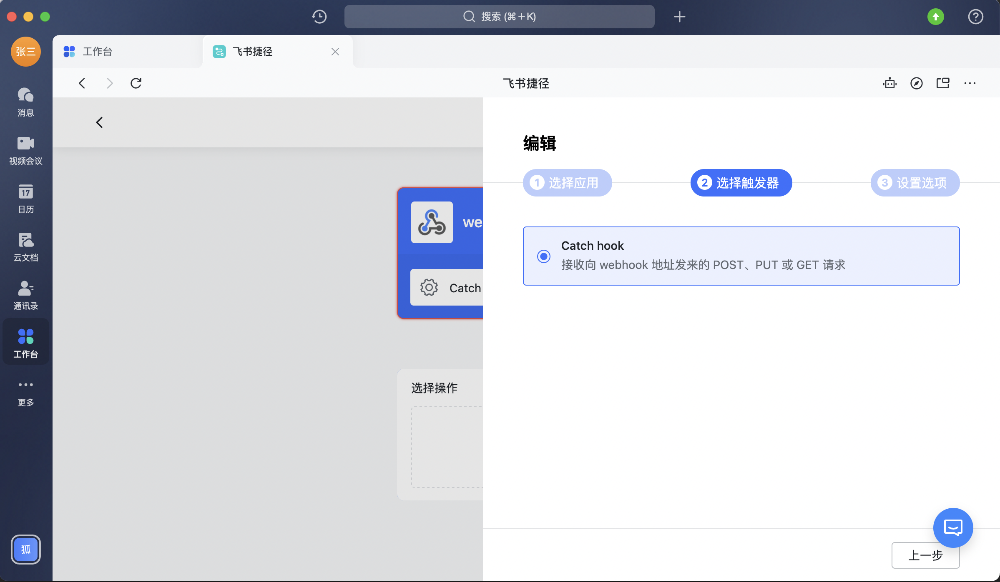

### 飞书捷径报警

#### 设置

单击报警设置的添加按钮，弹出配置框（输入您的机器人链接）

注：只有项目管理员才可以添加
<table>
	<center>
		<div>
        	<a></a><br>
		</div>
	</center>
</table>

#### 如何获取飞书捷径机器人链接?

打开飞书电脑版（而非手机版），搜索"飞书捷径"找到飞书捷径应用页面，点击"创建飞书捷径"。

<table>
	<center>
		<div>
        	<a></a><br>
		</div>
	</center>
</table>

点击"选择触发器"中的"+"图标。

<table>
	<center>
		<div>
        	<a></a><br>
		</div>
	</center>
</table>

搜索找到并点击"webhook"。

<table>
	<center>
		<div>
        	<a></a><br>
		</div>
	</center>
</table>

<table>
	<center>
		<div>
        	<a></a><br>
		</div>
	</center>
</table>

将下列示例JSON复制粘贴到"参数"。

```json
{
  "alerts":[
    {
      "title":"title1",
      "fundebugUrl":"https://www.fundebug.com/dashboard/629302b57a07f2015356f50d/error/6293c760b3d37bafe5c36c38?eventId=6293c762ada595000d0dd7d9",
      "content": "alert content"
    }
  ]
} 
```

<table>
	<center>
		<div>
        	<a></a><br>
		</div>
	</center>
</table>

在Picker中选择"alerts"，点击确认。
<table>
	<center>
		<div>
        	<a></a><br>
		</div>
	</center>
</table>

点击"选择操作"中的"+"图标。
<table>
	<center>
		<div>
        	<a></a><br>
		</div>
	</center>
</table>

您可以在"选择操作"中创建"飞书消息"。
<table>
	<center>
		<div>
        	<a></a><br>
		</div>
	</center>
</table>

<table>
	<center>
		<div>
        	<a></a><br>
		</div>
	</center>
</table>

<table>
	<center>
		<div>
        	<a></a><br>
		</div>
	</center>
</table>

实际上，在"选择操作"这一步，除了创建"飞书消息"，飞书捷径允许您根据您的实际需求选择不同的操作，例如创建文档，创建表格等，具体可参考飞书捷径官方文档。
<a link="https://www.feishu.cn/hc/zh-CN/categories-detail?category-id=6933474571966251035">飞书捷径官方文档</a><br>
如果您不需要更多复杂的操作，可忽略这一步。

再次点击"webhook"，复制链接。
<table>
	<center>
		<div>
        	<a></a><br>
		</div>
	</center>
</table>

<table>
	<center>
		<div>
        	<a></a><br>
		</div>
	</center>
</table>

粘贴到Fundebug报警设置框中。

<table>
	<center>
		<div>
        	<a></a><br>
		</div>
	</center>
</table>

在飞书捷径中点击"保存"。请务必保存，否则您的飞书捷径不会生效。
<table>
	<center>
		<div>
        	<a></a><br>
		</div>
	</center>
</table>
