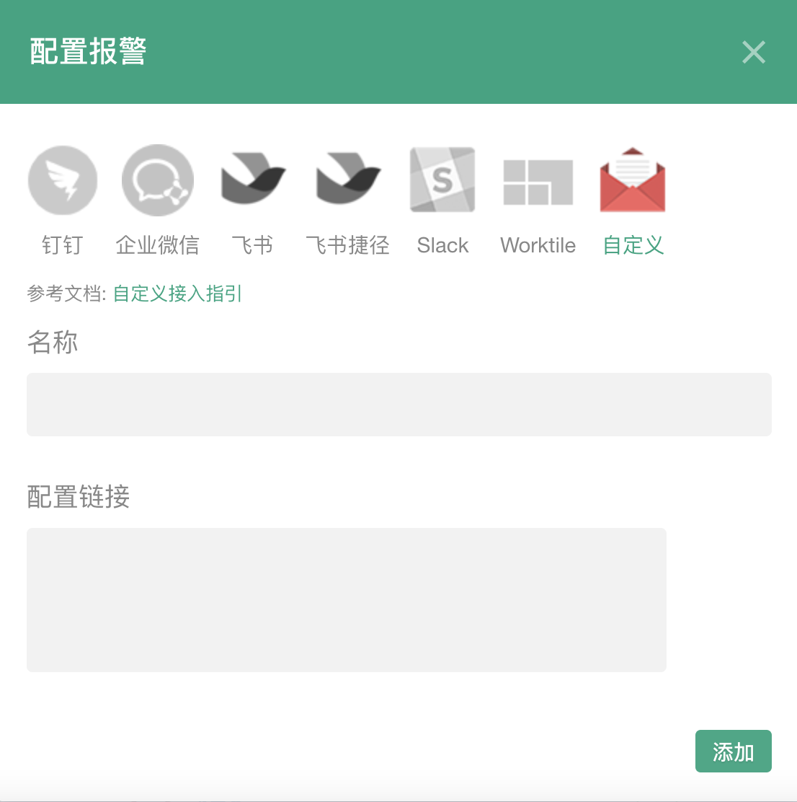

### 自定义Webhook报警

#### 设置

单击报警设置的添加按钮，弹出配置框（输入您的机器人webhook链接）

注：只有项目管理员才可以添加

<table>
	<center>
		<div>
        	<a></a><br>
		</div>
	</center>
</table>

**格式说明：**

Fundebug向自定义的地址发送一个POST请求，其body中的JSON可能如下字段：

- alertLimit: 报警限制
- alertRules: 报警规则
- projectId: 项目ID
- projectName: 项目名
- ReleaseStage: 发布阶段
- errorId: 错误ID
- eventId: 事件ID
- eventType: 类型
- NumberOfOccurence: 事件数
- NumberOfUser: 用户数
- notifierVersion: 通知器版本
- eventUrl: 页面
- eventTitle: 标题
- language: 语言
- eventOccurTime: 时间
- eventCreateTime: 创建时间
- eventIp: IP
- eventLocation: 位置
- eventUserAgent: User Agent
- eventDevice: 设备
- eventOs: 操作系统
- eventBrowser: 浏览器
- engineName: 引擎
- name: 错误名称
- message: 错误消息
- jsExecErrorFileName: 文件名
- jsExecErrorLineNumber: 行号
- jsExecErrorColumnNumber: 列号
- jsExecErrorStacktrace: 堆栈信息
- jsExecErrorSeverity: 严重性
- resourceLoadingErrorTargetOuterHTML: 外部HTML
- resourceLoadingErrorTargetSrc: src
- resourceLoadingErrorTargetTagName: 标签名
- resourceLoadingErrorTargetId: target ID
- resourceLoadingErrorTargetClassName: className属性
- resourceLoadingErrorTargetName: target name属性
- resourceLoadingErrorTargetXPath: XPath
- resourceLoadingErrorTargetSelector: selector
- resourceLoadingErrorTargetStatus: 状态码
- resourceLoadingErrorTargetStatusText: 状态文本
- HttpReqErrorReqMethod: 请求方法
- HttpReqErrorReqUrl: 请求URL
- HttpReqErrorReqParams: 参数
- HttpReqErrorResStatus: 状态码
- HttpReqErrorResStatusText: 状态文本
- HttpReqErrorResResponse: 返回数据
- eventElapsedTime: 耗时
- WebSocketConnErrorTargetType: target类型
- WebSocketConnErrorTargetUrl: target URL
- WebSocketConnErrorTargetTimeStamp: target时间戳
- fundebugUrl: 查看详情

<!-- 
JavaScript请求错误:
 ```js
 {
  type: 'javascript-http', // http请求错误
  projectName: 'website', // 项目名称
  numberOfUser: '10000', // 用户数
  numberOfOccurence: '100', // 出现次数
  fundebugUrl: 'https://www.fundebug.com/dashboard/123456/error/2345678' // 详情页
  errorUrl: 'www.xxx.com/xxx', // 出错页面（可无）
  httpMethod: 'POST', // HTTP请求错误：请求方式（可无）
  httpUrl: 'https://www.fundebug.com/', // HTTP请求错误： 请求路径（可无）
  httpStatus: 500 // HTTP请求错误： 请求状态（可无）
 }
```

JavaScript资源加载错误:
 ```js
 {
  type: 'javascript-resource', // 资源加载错误
  projectName: 'website', // 项目名称
  numberOfUser: '10000', // 用户数
  numberOfOccurence: '100', // 出现次数
  fundebugUrl: 'https://www.fundebug.com/dashboard/123456/error/2345678' // 详情页
  errorUrl: 'www.xxx.com/xxx', // 出错页面（可无）
  targetSrc: "http://192.168.59.2:3000/test.jpg",  // 加载：资源路径（可无）
  targetStatus: 404 // 资源加载：加载状态（可无）
 }
```

JavaScript执行错误:
 ```js
 {
  type: 'javascript-error', // JavaScript执行错误
  projectName: 'website', // 项目名称
  numberOfUser: '10000', // 用户数
  numberOfOccurence: '100', // 出现次数
  fundebugUrl: 'https://www.fundebug.com/dashboard/123456/error/2345678' // 详情页
  errorUrl: 'www.xxx.com/xxx', // 出错页面（可无）
  errorName: 'catchError', // 错误名称（可无）
  errorMessage: 'TypeError: undefined is not an object ...', // JavaScript错误信息（可无）
 }
```

微信小程序错误:
 ```js
 {
  type: 'wxjs', // 微信小程序错误
  projectName: 'wxjs', // 项目名称
  numberOfUser: '10000', // 用户数
  numberOfOccurence: '100', // 出现次数
  fundebugUrl: 'https://www.fundebug.com/dashboard/123456/error/2345678', // 详情页
  errorPage: event.page, //出错页面 （可无）
  errorName: 'TypeError', // 错误类型（可无）
  errorMessage: 'TypeError: undefined is not an object ...' // JavaScript错误信息（可无）
 }
```

nodejs请求错误:
 ```js
 {
  type: 'nodejs-http', // http请求错误
  projectName: 'nodejs', // 项目名称
  numberOfUser: '10000', // 用户数
  numberOfOccurence: '100', // 出现次数
  fundebugUrl: 'https://www.fundebug.com/dashboard/123456/error/2345678', // 详情页
  errorName: 'TypeError', // 错误类型（可无）
  errorMessage: 'TypeError: undefined is not an object ...', // JavaScript错误信息（可无）
  httpMethod: 'POST', // HTTP请求错误：请求方式（可无）
  httpUrl: 'https://www.fundebug.com/', // HTTP请求错误： 请求路径（可无）
  httpStatus: 500 // HTTP请求错误： 请求状态（可无）
 }
```

nodejs执行错误:
 ```js
 {
  type: 'nodejs-error', // nodejs执行错误
  projectName: 'nodejs', // 项目名称
  numberOfUser: '10000', // 用户数
  numberOfOccurence: '100', // 出现次数
  fundebugUrl: 'https://www.fundebug.com/dashboard/123456/error/2345678', // 详情页
  errorName: 'TypeError', // 错误类型（可无）
  errorMessage: 'TypeError: undefined is not an object ...' // JavaScript错误信息（可无）
 }
``` -->
