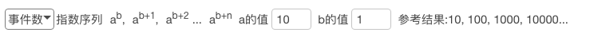
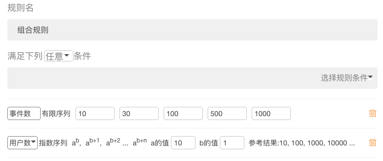

### 报警规则

每当某个错误有新的事件产生，立即推送报警必然不合理。如果一个错误短时间内出现10000次，意味着邮箱短时间内收到10000封邮件。 
因此，按照某种规则来触发报警邮件更加合理。Fundebug 提供两种风格的报警规则：
-   指数序列
-   有限序列

用户可以根据各自的喜好来选择甚至组合起来。

#### 指数序列

当累计出错的事件数刚好是指数序列中的值，就会触发报警系统发送报警邮件。通过设置指数的底数`a`和起始指数`n`，来灵活配置报警的间隔和次数。
如下图示例，当底数为10，起始指数为1时，指数序列为`10, 100, 1000, ...`。那么，当某个错误的出错事件数达到`10, 100, 1000, ...`的时候，会收到报警邮件。
<table>
	

		

        	 
		

	

</table>

#### 有限序列

如果想在某些特定的事件数触发报警，这个时候指数序列无法满足需求，则可以自定义一个有限序列来达到目的。
比如，设置`1, 5, 10, 20, 50`的有限序列来触发报警。

<table>
	

		

        	 
		

	

</table>

#### 规则组合

通过将简单的规则组合，来满足更复杂的报警设置。组合条件可以设置为或/且的关系。
<table>
	

		

        	 
		

	

</table>