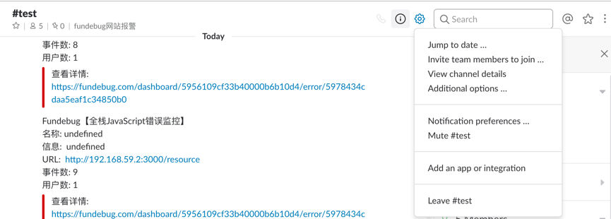

### Slack报警

#### 设置

单击报警设置的添加按钮，弹出配置框（输入您的机器人webhook链接）

注：只有项目管理员才可以添加
<table>
	

		

        	 
		

	

</table>

#### 如何获取Slack机器人链接?

在讨论组界面右上角，鼠标移动至**设置**按钮，单击**Add an app or integration**进入App管理界面

<table>
	

		

        	 
		

	

</table>

点击右上角**Manage**，进入App管理界面

<table>
	

		

        	 
		

	

</table>

选择**Custom Integrations**，点击**Incoming WebHooks**进入WebHook配置界面

<table>
	

		

        	 
		

	

</table>

点击**Add Configuration**

<table>
	

		

        	 
		

	

</table>

选择您要配置的讨论组（示例选择了后端开发讨论组），单击**Add Incoming WebHooks integration**

<table>
	

		

        	 
		

	

</table>

图中*WebHook URL**即为配置链接

<table>
	

		

        	 
		

	

</table>
