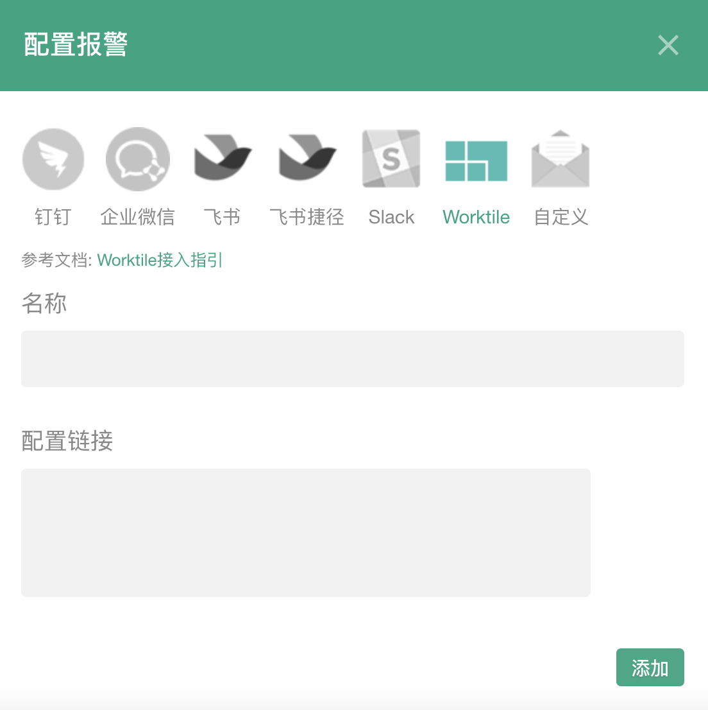

### Worktile报警

#### 设置

单击报警设置的添加按钮，弹出配置框（输入您的机器人webhook链接）

注：只有项目管理员才可以添加

<table>
	

		

        	 
		

	

</table>

#### 如何获取Worktile机器人链接?

点击**设置**弹出可选框，单击**配置服务集成**，进入服务管理界面

<table>
	

		

        	 
		

	

</table>

选择**其它**，点击**添加Incoming Webhook**

<table>
	

		

        	 
		

	

</table>

选择一个您需要发送消息的群组（示例图选择test）

<table>
	

		

        	 
		

	

</table>

**WebHook URL**即为配置链接

<table>
	

		

        	 
		

	

</table>
