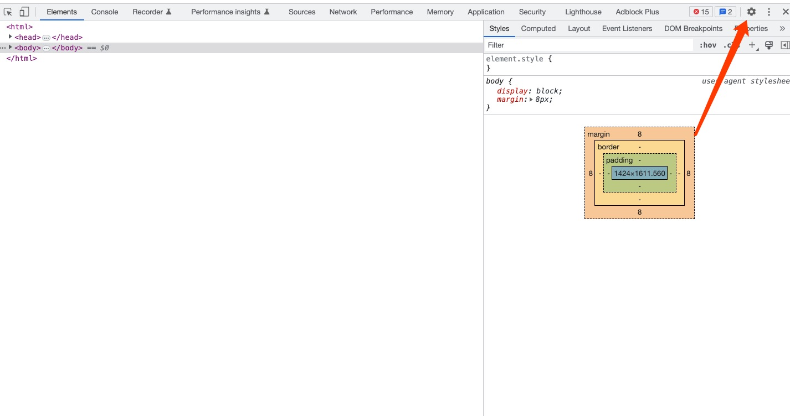

## 配置浏览器[Ignore List](https://developer.chrome.com/docs/devtools/settings/ignore-list/)

Fundebug 通过重写 console 对象监控浏览器控制台的打印信息，并添加到用户行为中。这样会导致在控制台下打印的日志无法正确看到原代码文件中的位置：

这样会造成开发过程中的困扰，可以通过配置浏览器[ignore List](https://developer.chrome.com/docs/devtools/settings/ignore-list/)来解决问题。

#### 1. 进入开发者工具面板，选择 Settings

#### 2. 在左侧菜单栏点击 Ignore List

#### 3. 点击 Add pattern...

如果使用script加载，将`fundebug.min.js`的完整路径填进去：
 - `https://js.fundebug.cn/fundebug.min.js`

 

### 4. 如果使用npm安装，请按照下面的步骤来添加

- 点击`source`

 

- 点击`node_modules`
 

 

- 点击`fundebug-javascript`

 

- 选中`fundebug.min.js`，右键选择`Add script to ignore list`。如果没有这个选项，点击`Copy link address`，然后按照步骤3来操作。

 

#### 5. 再次刷新页面

将会看到 Fundebug 插件已经不会干扰 Console 输出了:\*\*

 

#### 参考

-   [Chrome 文档：Ignore List](https://developer.chrome.com/docs/devtools/settings/ignore-list/)
