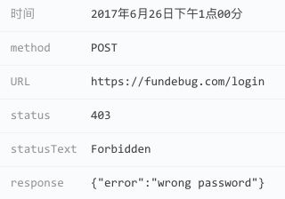

#### HTTP请求错误

**HTTP请求错误**在Fundebug控制台的图标如下：

<table>
	<br>
</table>

前端通过大量的API与后端进行交互，这些API也有可能出错。

通常，后端会通过日志记录所有HTTP请求，但是查询起来非常不便，也不及时。Fundebug可以捕获所有HTTP请求错误，同时记录用户行为，并实时提醒开发者，且不需要修改后端，也不需要搭建复杂的日志系统。

下面的示例中，登陆账户时密码错误，因此会报403错误。

```javascript
var xhr = new XMLHttpRequest();
xhr.open("POST", "https://api.fundebug.com/login");
xhr.setRequestHeader('Content-Type', 'application/json');
xhr.send(JSON.stringify(
{
    email: "help@fundebug.com",
    password: "akhakfnak"
}));
```

开发者可以在Fundebug控制台错误详情: 

<table>
	<br>
</table>


Fundebug插件捕获的错误数据如下：

```javascript
{
    "notifierVersion": "0.2.0",
    "userAgent": "Mozilla/5.0 (Macintosh; Intel Mac OS X 10.12; rv:54.0) Gecko/20100101 Firefox/54.0",
    "locale": "zh",
    "url": "http://localhost:4000",
    "title": "Test",
    "apiKey": "API-KEY",
    "time": 1502864518516,
    "type": "httpError",
    "req": {
        "method": "POST",
        "url": "https://www.fundebug.com/login"
    },
    "res": {
        "status": 403,
        "statusText": "Forbidden",
        "response": "{\"error\":\"wrong password\"}"
    }
}
```

**HTTP请求错误**的**type**属性值为**httpError**。


##### silentHttp

如果你不需要监控**HTTP请求错误**，则可以将[silentHttp](../customize/silenthttp.md)属性设为true。