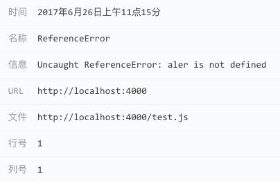

#### JavaScript执行错误

**JavaScript执行错误**在Fundebug控制台的图标如下：

<table>
	<br>
</table>

由于拼写失误，测试不完善，或者是意外的边界条件，JavaScript代码在用户浏览器中执行时，有可能会出错。

下面的示例中，alert被写成了aler，因此会报ReferenceError：

```javascript
aler("hello");
```

Fundebug插件捕获的这个错误之后，开发者将受到报警，然后可以在我们的控制台查看错误详情：

<table>
	<br>
</table>


Fundebug插件捕获的错误数据如下：

```javascript
{
    "notifierVersion": "0.2.0",
    "userAgent": "Mozilla/5.0 (Macintosh; Intel Mac OS X 10.12; rv:54.0) Gecko/20100101 Firefox/54.0",
    "locale": "zh",
    "url": "http://localhost:4000",
    "title": "Test",
    "apiKey": "API-KEY",
    "name": "ReferenceError",
    "time": 1502863944724,
    "message": "Uncaught ReferenceError: aler is not defined",
    "fileName": "http://localhost:4000/test.js",
    "lineNumber": 1,
    "columnNumber": 1,
    "stacktrace": "@http://localhost:4000/test.js:1:1\n",
    "type": "uncaught",
    "severity": "error"
}
```

**JavaScript执行错误**的**type**属性值分为**caught**或者**uncaught**两种，**caught**为**[notifyError](../api/notifyerror.md)**发送的错误，而**uncaught**为Fundebug插件自动捕获的错误。