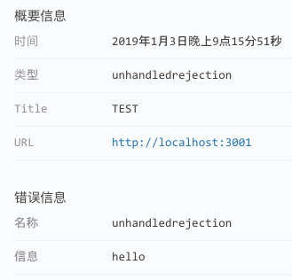

## unhandledrejection

**unhandledrejection**，即未使用 catch 处理的 Promise 错误：

```javascript
Promise.reject("hello");
```

Fundebug 插件捕获的这个错误之后，开发者将受到报警，然后可以在我们的控制台查看错误详情：

<table>
	<br>
</table>

Fundebug 插件捕获的错误数据如下：

```javascript
{
    "notifierVersion": "1.5.1",
    "userAgent": "Mozilla/5.0 (Macintosh; Intel Mac OS X 10_14_2) AppleWebKit/537.36 (KHTML, like Gecko) Chrome/71.0.3578.98 Safari/537.36",
    "locale": "zh-CN",
    "url": "http://localhost:3001",
    "title": "TEST",
    "releaseStage": null,
    "name": "unhandledrejection",
    "time": 1546521929451,
    "message": "hello",
    "type": "unhandledrejection"
}
```

### 过滤

如果不需要监控 unhandledrejection 的话，可以通过配置[filters](../customize/filters.md)来实现：

```javascript
if ("fundebug" in window) {
    fundebug.filters = [
        {
            type: /^unhandledrejection$/
        }
    ];
}
```
