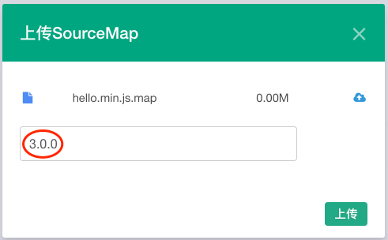
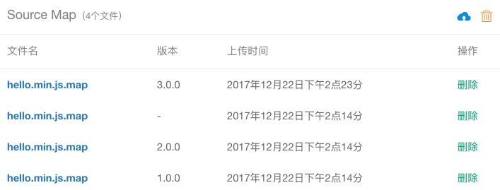

#### 通过前端UI上传Source Map

##### 上传步骤

1. 进入『控制台』
2. 选择『项目设置』
3. 点击『Source Map』
4. 选中需要上传的Source Map文件(支持上传多个Source Map文件)
5. 点击『上传』

##### 设置应用版本(可选)

上传Source Map时可以配置应用版本:

	
	
下图为不同版本的Source Map:

若希望区分不同版本的Source Map，则在接入Fundebug时，必须配置对应的[appversion](../../customize/appversion.md)属性，并在代码更新时及时更新。

