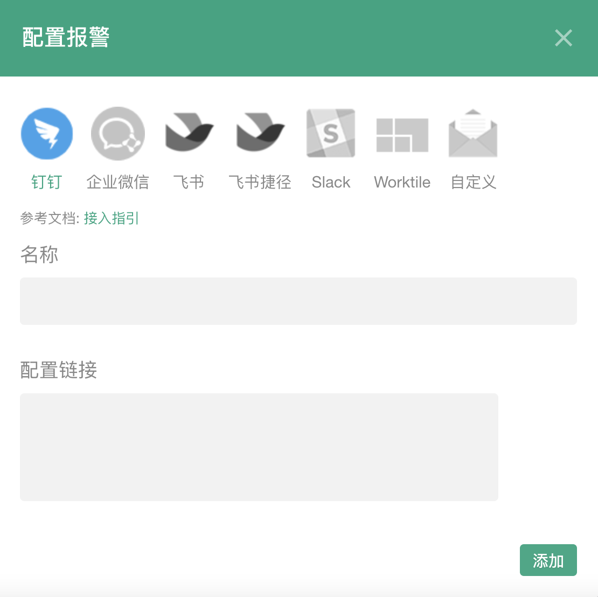

### 钉钉报警

#### 设置

单击报警设置的添加按钮，弹出配置框（输入您的机器人链接）

注：只有项目管理员才可以添加
<table>
	

		

        	 
		

	

</table>

#### 如何获取钉钉机器人链接?

选择需要添加机器人的群聊，然后依次单击**群设置 > 智能群助手**。

<table>
	

		

        	 
		

	

</table>

选择**自定义**，进入自定义配置详情界面

<table>
	

		

        	 
		

	

</table>

单击**添加**，进入添加机器人界面

<table>
	

		

        	 
		

	

</table>

给您的机器人选择一个合适的名字，并添加到某个群组，然后点击**下一步**

<table>
	

		

        	 
		

	

</table>

配置**自定义关键词**

<table>
	

		

        	 
		

	

</table>

勾选“同意”，并点击“完成”
<table>
	

		

        	 
		

	

</table>

完成安全设置后，复制出机器人的Webhook地址，填入Fundebug网站的钉钉报警配置。

<table>
	

		

        	 
		

	

</table>
