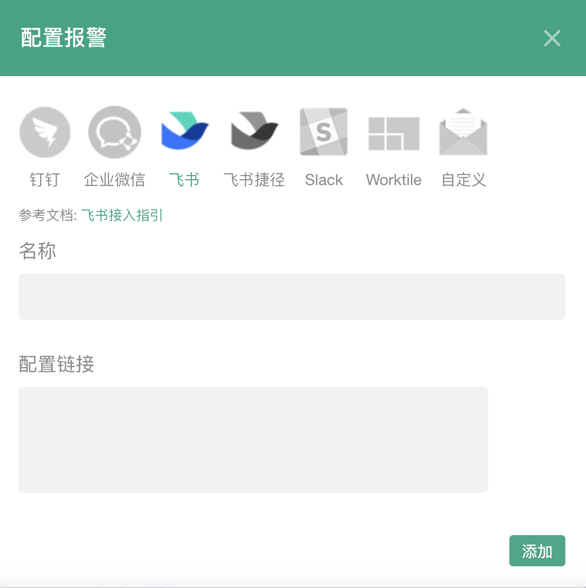
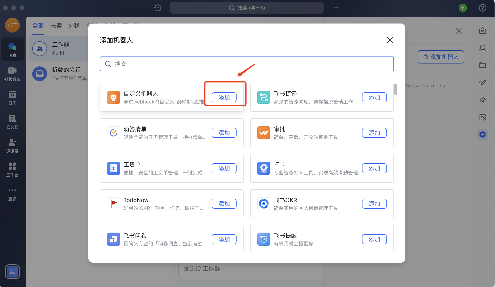
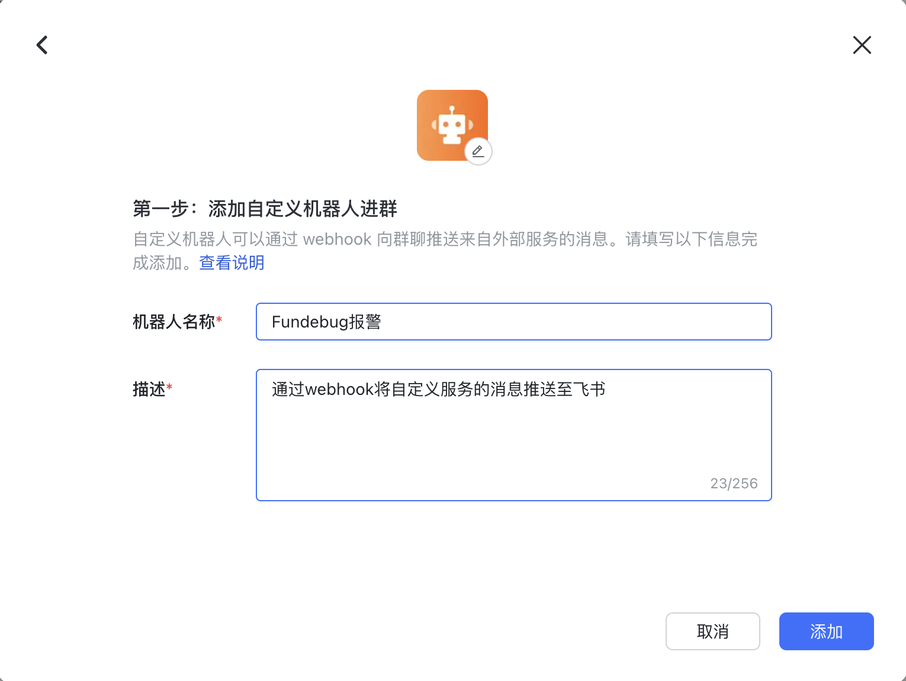
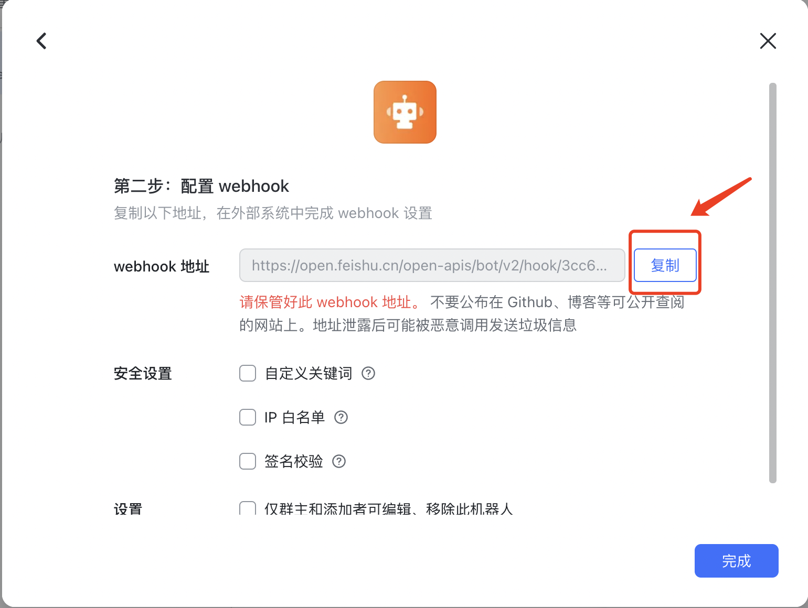
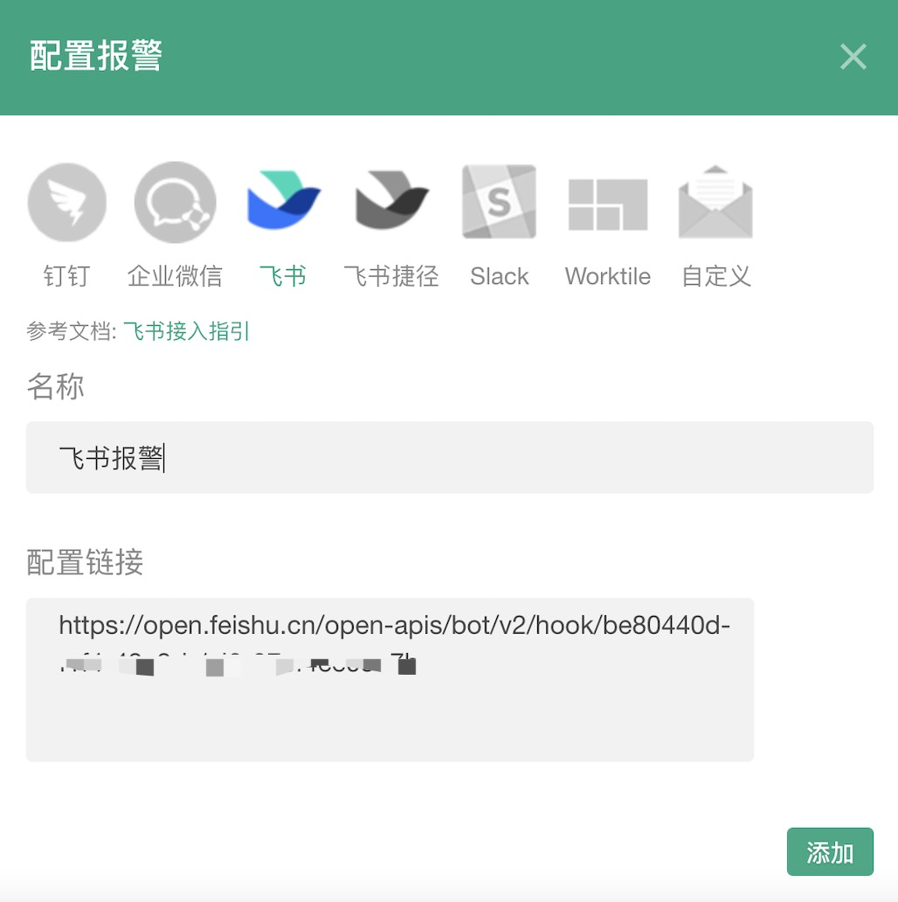

### 飞书报警

#### 设置

单击报警设置的添加按钮，弹出配置框（输入您的机器人链接）

注：只有项目管理员才可以添加
<table>
	

		

        	 
		

	

</table>

#### 如何获取飞书机器人链接?

打开飞书电脑版（而非手机版），选择需要添加机器人的群聊，点击设置，点击"群机器人"，点击"添加机器人"，点击"自定义机器人"中的"添加"。

<table>
	

		

        	 
		

	

</table>

修改机器人名称，点击"添加"。

<table>
	

		

        	 
		

	

</table>

复制出机器人的Webhook地址，填入Fundebug网站的飞书报警配置。

<table>
	

		

        	 
		

	

</table>

<table>
	

		

        	 
		

	

</table>
