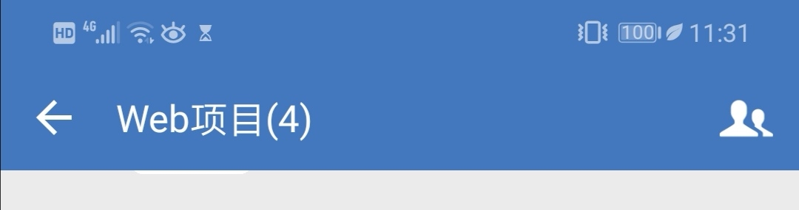
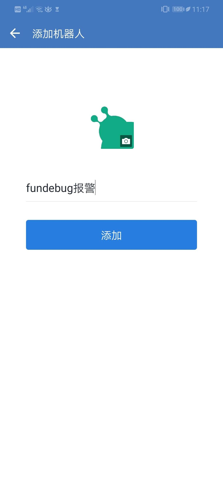

### 企业微信报警

#### 设置

单击报警设置的添加按钮，弹出配置框（输入您的机器人Webhook链接）

注：只有项目管理员才可以添加
<table>
	

		

        	 
		

	

</table>

#### 如何获取企业微信机器人Webhook链接?

在手机上打开企业微信APP，进入要接收报警消息的群，点击右上角的头像图标。

<table>
	

		

        	 
		

	

</table>

然后找到“群机器人”选项，点击进入。

<table>
	

		

        	 
		

	

</table>

点击“添加机器人”。

<table>
	

		

        	 
		

	

</table>

上传头像并输入机器人名字。

推荐使用Fundebug的logo作为头像(<a href="../../../images/alert/wechatwork/logo.jpg" target="_blank">logo.jpg</a>)。
效果如下：

<table>
	

		

        	 
		

	

</table>

点击“添加”

<table>
	

		

        	 
		

	

</table>

复制出机器人的Webhook地址，填入企业微信报警配置。
