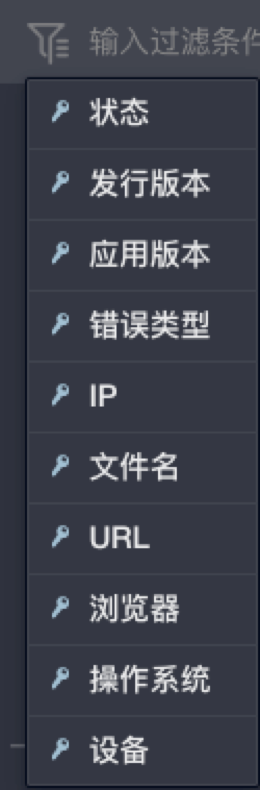
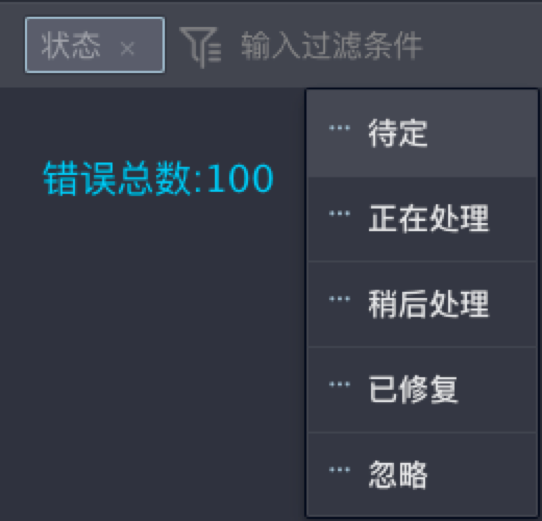
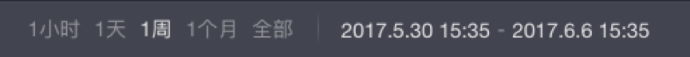

## 过滤栏

**菜单栏**之下即为**过滤栏**：

<table>
	

		

        	 
		

	

</table>

单击过滤**输入框**，即可看到过滤条件:

<table>
	

		

        	 
		

	

</table>

选择**状态**，即可根据错误状态进行过滤:

<table>
	

		

        	 
		

	

</table>

过滤栏的右侧可以设置过滤时间，查看特定时间区间的错误。

<table>
	

		

        	 
		

	

</table>

 