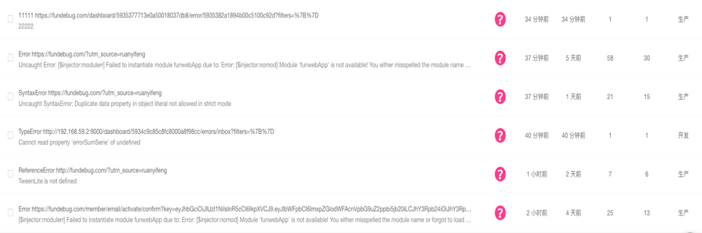
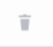

## 错误列表

**功能栏**之下即为**错误列表**:

<table>
	

		

        	 
		

	

</table>

​单击左侧**可选框**，就会弹出**状态修改框**，即可可对错误状态进行修改:

<table>
	

		

        	 
		

	

</table>

#### 分配任务:

<table>
	

		

        	 
		

	

</table>

#### 已解决:

<table>
	

		

        	 
		

	

</table>

#### 稍后处理

<table>
	

		

        	 
		

	

</table>

#### 忽略

<table>
	

		

        	 
		

	

</table>

#### 删除

<table>
	

		

        	 
		

	

</table>

 