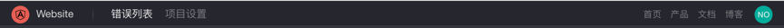
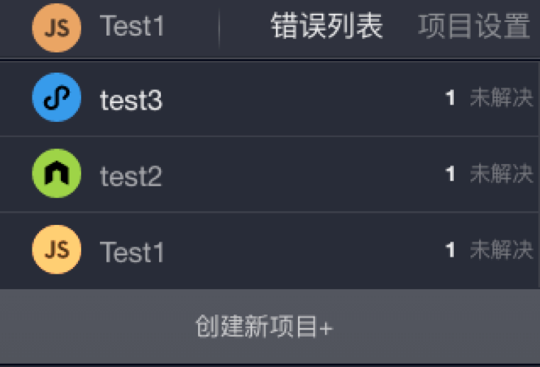
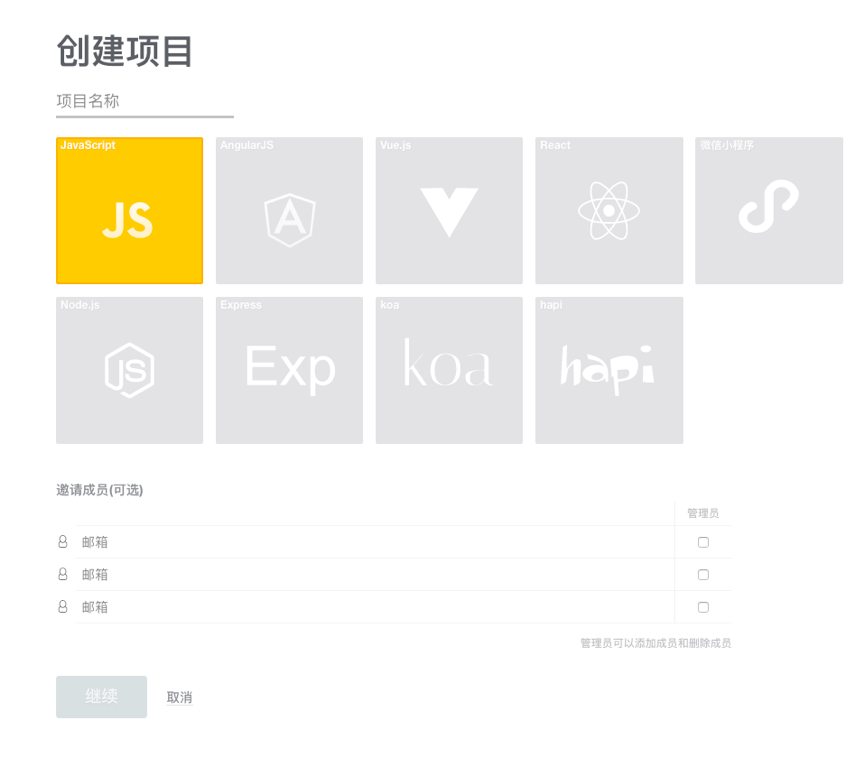
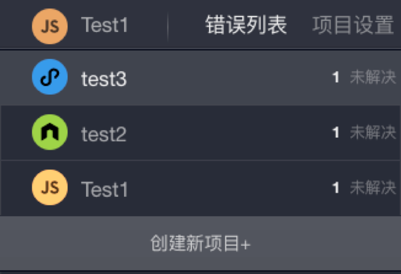

## 菜单栏

控制台的最上方是菜单栏，提供了项目切换、项目设置等功能。

<table>
	

		

        	 
		

	

</table>

#### 创建项目

单击菜单栏最左侧的**项目头像**，即可看到项目列表。

<table>
	

		

        	 
		

	

</table>

单击**创建新项目+**来创建新的项目:

<table>
	

		

        	 
		

	

</table>

输入项目名称并选择语言(框架)，即可创建项目（邀请成员为可选项）。

#### 切换项目

​单击菜单栏最左侧的**项目头像**，即可看到项目列表:

<table>
	

		

        	 
		

	

</table>

单击对应项目名称即可切换项目。

