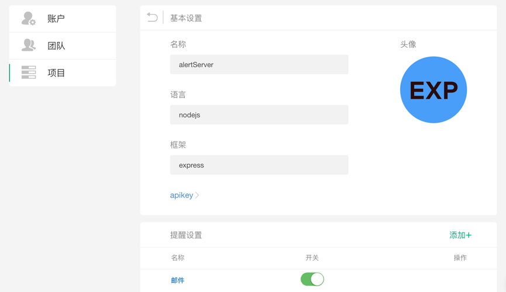

## 设置

在菜单栏单击右侧的**头像**，再单击**设置**，即可进入**账户**设置页面:

<table>
	

		

        	 
		

	

</table>

在菜单栏中单击左侧的**项目**设置，即可进入对应的**项目设置**页面：

<table>
	

		

        	 
		

	

</table>

具体设置方法，请查看对应文档

- [账户设置](./member.md)
- [团队设置](./team.md)
- [项目设置](./project.md)
