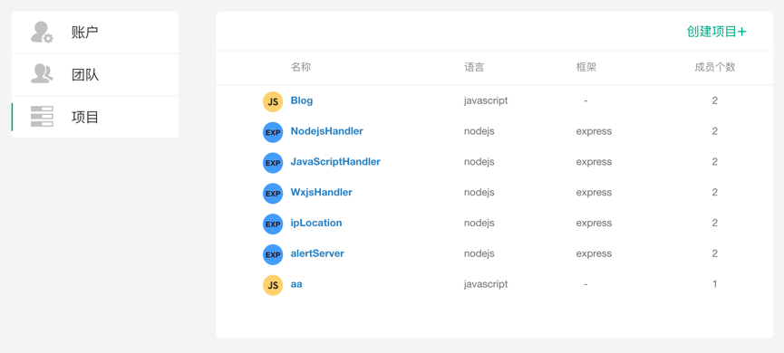
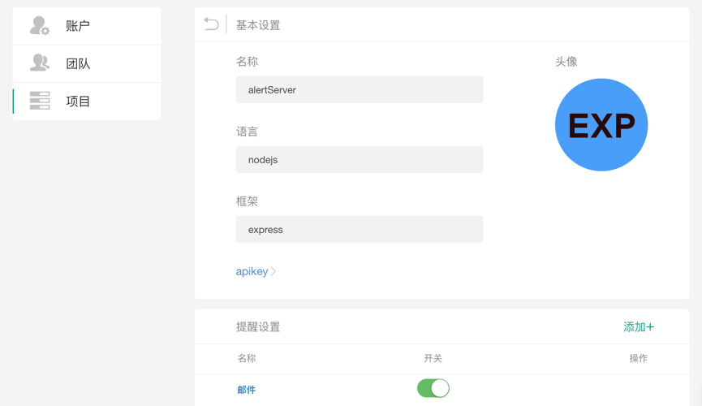
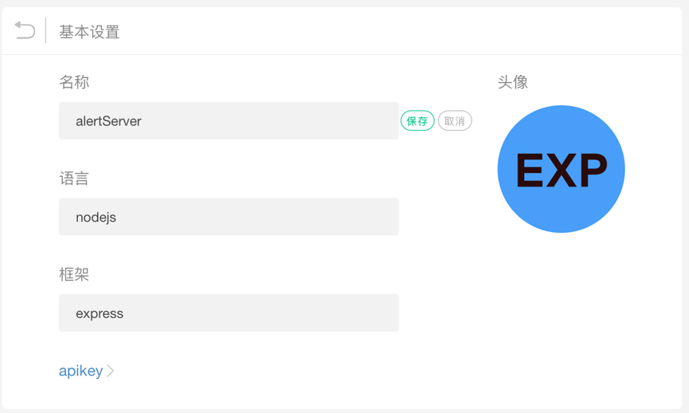
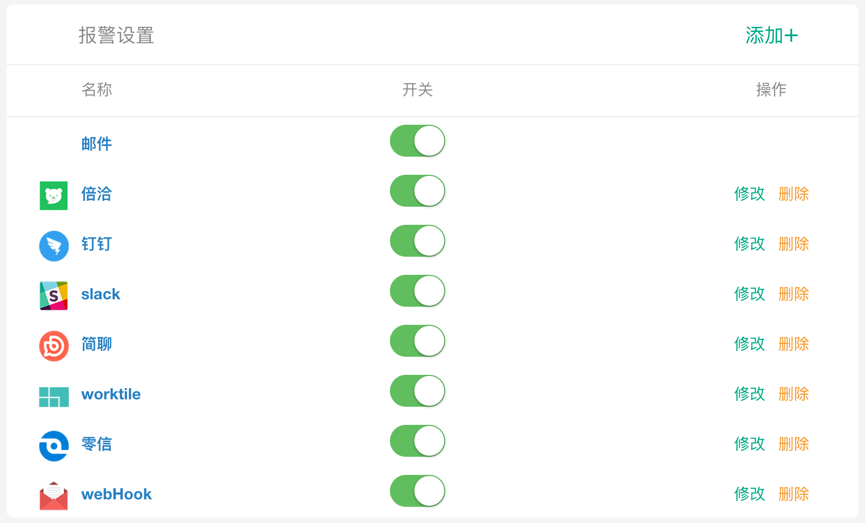
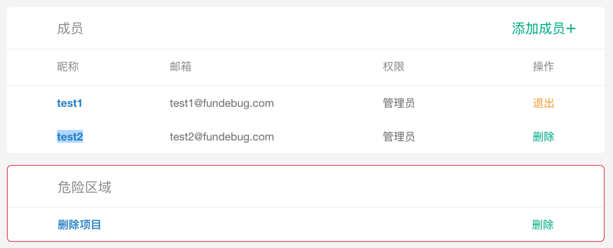

## 项目设置

#### 项目总览

单击菜单栏中的**项目**，进入项目列表页面
<table>
	

		

        	 
		

	

</table>

点击进入某个具体项目

<table>
	

		

        	 
		

	

</table>

#### 基本设置

<table>
	

		

        	 
		

	

</table>

#### [报警设置](../../alert/index.md) 

<table>
	

		

        	 
		

	

</table>

#### source Map

<table>
	

		

        	 
		

	

</table>

#### 成员及项目管理

<table>
	

		

        	 
		

	

</table>

